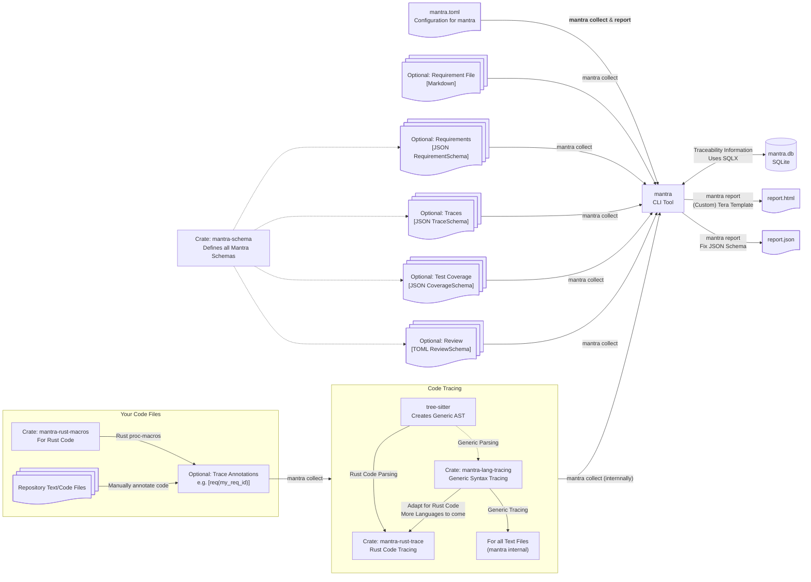

## Overall Architecture

### Main *mantra* Commands

- `mantra collect`

  Used to collect traceability information.
  The command uses the configuration in `mantra.toml` to know what files/folders to search for information.

  The result is a SQLite database that contains all collected traceability information.

- `mantra report`

  Used to generate a (custom) traceability report.
  Supported output formats are currently only HTML and JSON.

  The Tera templating engine is used to generate HTML reports.
  It is possible to provide custom templates that may access the data from the JSON report.

### Trace Collection

Trace collection is integrated into *mantra* for all text file types.
This includes code files for most programming languages.

By default, *mantra* uses regular expressions to detect requirement traces.
This enables *mantra* to support tracing for various languages out of the box.

To get advanced trace information, such as associated code elements and spans,
*mantra* uses [tree-sitter](https://tree-sitter.github.io/tree-sitter/index.html) to create a generic AST per file.
This AST may then be traversed to detect requirements traces.

The associated span information that is collected with the tree-sitter approach
enables *mantra* to combine code coverage data from tests with the collected traces
to calculate the requirement coverage.

Currently, the AST approach is only implemented for Rust code. 
